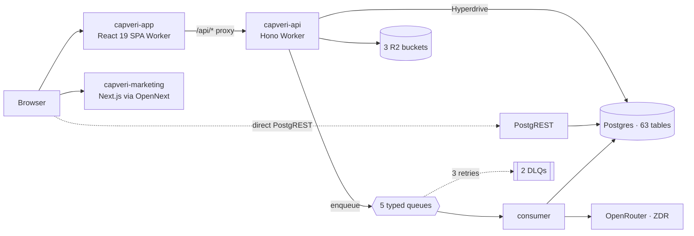
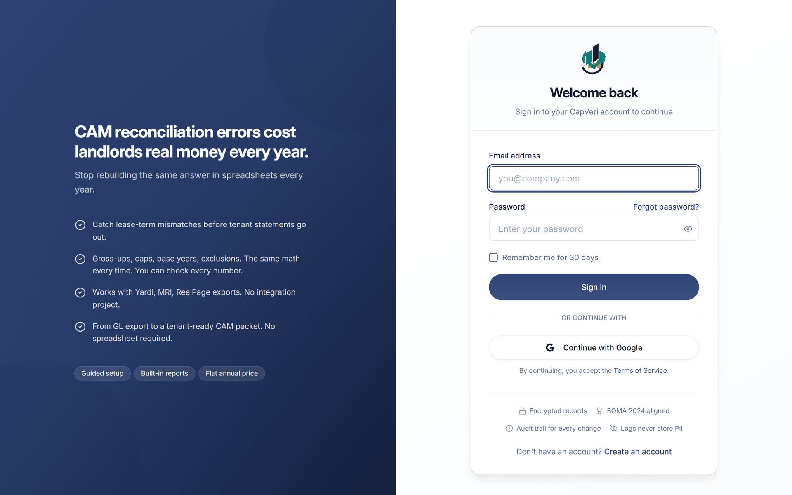
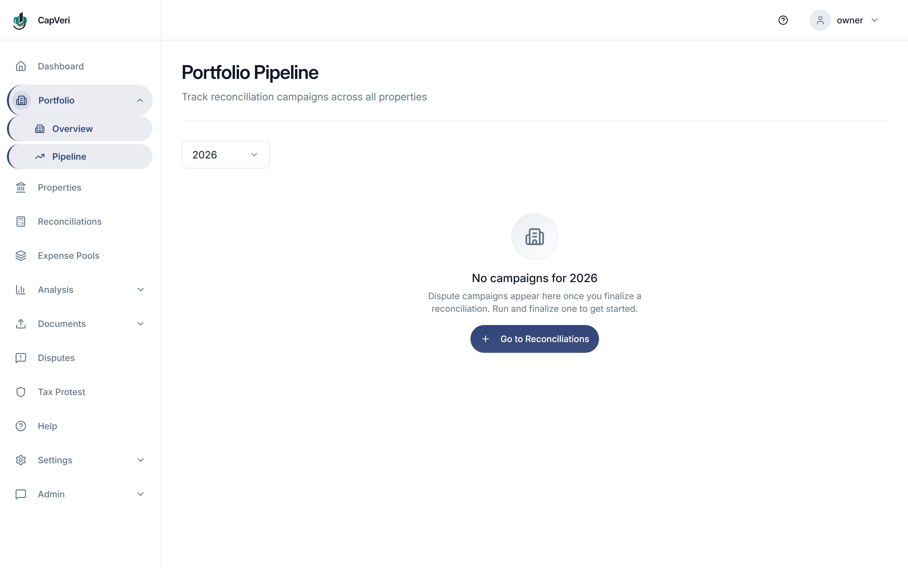
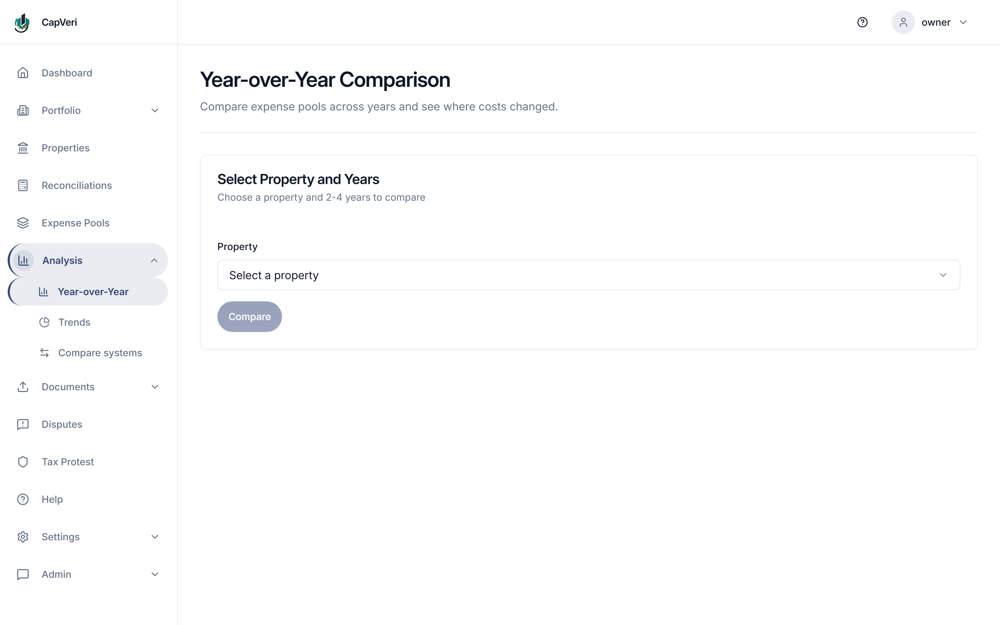
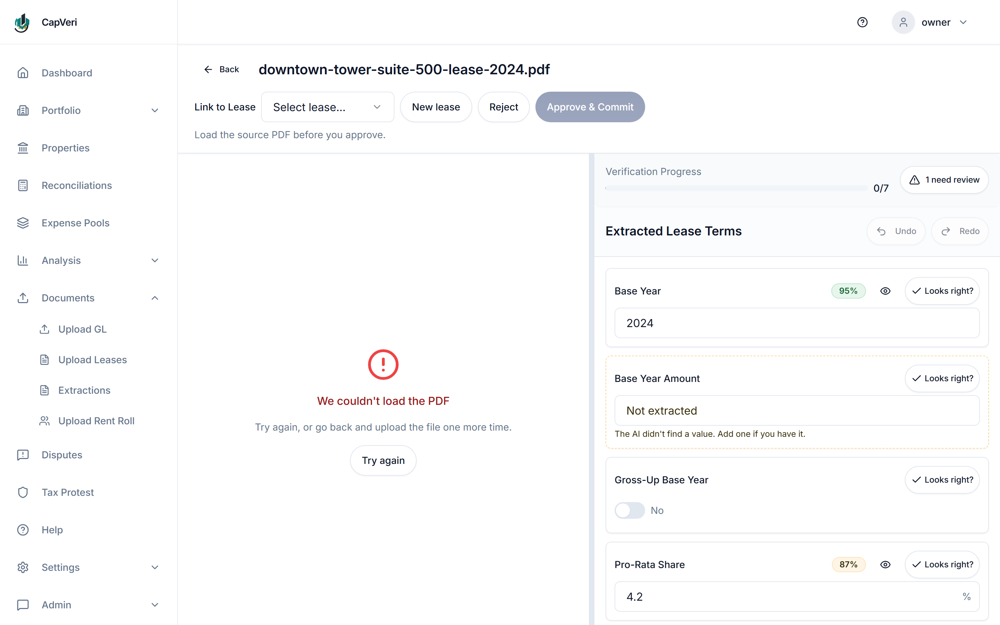

# CapVeri

A web platform for commercial-real-estate landlords that automated CAM reconciliation: the annual
job of working out how much of a building's operating costs each tenant owes. Every lease
negotiates its own caps, gross-ups, base years, and exclusions, and they interact. It is normally
done in Excel, once a year, and the result goes to tenants who may dispute it in court.

CapVeri was formerly branded CAMAudit; `camaudit.io`, `camaudit_frontend`, and other `camaudit`-prefixed
identifiers throughout this repository (see [INFRASTRUCTURE.md](./portfolio/INFRASTRUCTURE.md) and
[docs/migration/README.md](./docs/migration/README.md)) refer to this same product under its old name.

> [!IMPORTANT]
> **Status: sunset.** Development ended on 2026-07-03. This repository is preserved as an
> engineering record, and everything here is past tense. Every number below was measured from the
> repository itself, and [METRICS.md](./portfolio/METRICS.md) gives the command behind each one.

> [!NOTE]
> Built solo by **Angel Campa** ([@AngelCampa1](https://github.com/AngelCampa1)). Source-available,
> all rights reserved, published to be read and evaluated, not reused. See [LICENSE](./LICENSE).


**364,654 lines of application source · 534,150 lines of test · 16,758 tests passing across 1,115
files · 142 migrations · 63 tables · 5,242 commits over 125 active days**

![CapVeri's Calculation Breakdown drawer, open over the Downtown Tower 2024 reconciliation. Four numbered steps each print their own arithmetic: Step 1 fetches $150,000.00 of operating expenses, Step 2 grosses up with the literal expression 150000.00 * 1.0752688 = 161290.32, Step 3 takes the tenant's 5% share as 161290.32 * 0.05 = 8064.52, and Step 4 deducts the base year as 8064.52 - 7800.00 = 264.52. Behind the drawer, a per-tenant table shows Design Studio at $8,064.52 and FinanceGroup LLC at $4,838.71.](./portfolio/screenshots/21-calculation-trace.png)

*Showing its work, literally. Every number a tenant could dispute expands into the arithmetic that
produced it, one step at a time, with the operands visible. Captured from the local stack against
seeded data.*

The engineering bet was a second implementation. After the money math was ported from Python to
TypeScript, the Python was not deleted. It was kept, never deployed, and continuously tested for
the sole purpose of disagreeing with the engine that shipped. Money was held as BigInt integer
cents, never a float, and 104 scenario scripts drove the live API with penny-exact expectations
computed offline.

---

## Contents

- [If you read one thing](#if-you-read-one-thing)
- [What it did](#what-it-did)
- [Architecture](#architecture)
- [What's worth your time here](#whats-worth-your-time-here)
- [Engineering log](#engineering-log)
- [By the numbers](#by-the-numbers)
- [Testing](#testing)
- [Screenshots](#screenshots)
- [Repository map](#repository-map)
- [Documentation](#documentation)
- [Built with AI agents](#built-with-ai-agents)
- [Running it locally](#running-it-locally)
- [Who built this](#who-built-this)
- [License](#license)

---

## If you read one thing

[`mapSubscriptionStatus` returned `"active"` from its `default` branch](./portfolio/ENGINEERING-LOG.md#6-the-status-mappers-default-branch-handed-out-free-access),
so a Stripe subscription stuck pending 3-D Secure got full premium access.

The interesting part is not the bug. It is that **the Python reference implementation had the
identical bug, and still does** at
[`backend/app/api/routes/webhooks.py:1008`](./backend/app/api/routes/webhooks.py#L1008). Parity
between the two engines was perfect and both were wrong. Matching the reference would have
preserved the vulnerability. Each Stripe status was researched individually instead, the divergence
was documented, and unknown statuses were made to fail closed. The oracle was left alone on purpose:
one edited to agree with the code it checks is worth nothing.

That is the thesis of this codebase in one commit: a second opinion is only useful if you are
willing to rule against it.

## What it did

A landlord pays a building's operating costs, and the tenants reimburse them in proportion to the
space they occupy. Working out what each tenant actually owed at year end is not a division: on top
of the caps, gross-ups, base years, and exclusions described above, a lease can layer its own
administrative fees, and the whole thing is usually assembled in Excel under time pressure.

CapVeri imported the general ledger and rent roll exports the landlord's property-management system
already produced. No API integrations with Yardi or MRI. It extracted lease terms with a human
confirming every field, computed the true-up, and showed its work in the Calculation Breakdown
drawer at the top of this page.


*The landing screen is a work queue, not a chart wall. The one number at the top is the money that
has not been checked yet.*


*The four steps gate each other: finalize is unreachable until review happens. The amber banner is a
real check firing on the seeded data: one expense pool has no GL mappings, so its expenses would
reach no tenant. The product says so before the numbers are trusted rather than after.*


*The same recovery difference in the two numbers a landlord's principal acts on: additional annual
NOI, and the implied change in building value. The cap rate is a slider because it is an assumption,
and assumptions belong to the user.*

Lease terms came out of PDFs by model extraction, and nothing a model produced was trusted:


*This is the commit gate refusing. The source PDF would not load, so the reviewer could not check
the extraction against the document, so **Approve & Commit is disabled** and the reason is printed
underneath it. Model output landed in a holding column and reached the lease record only after a
human confirmed each field. The failure in this shot is the invariant holding, not the product
breaking.* → [AI-PIPELINE.md](./portfolio/AI-PIPELINE.md)

→ [WALKTHROUGH.md](./portfolio/WALKTHROUGH.md) follows one reconciliation from the login screen
to the tenant's statement, naming the code behind each step ·
[PRD.md](./portfolio/PRD.md) is the domain primer and the gallery

## Architecture

Four independently deployed Cloudflare Workers over Supabase Postgres. No origin server, no
containers.



| Worker | Stack | Owned |
|---|---|---|
| `capveri-api` | Hono, TypeScript | 43 route modules, queue producer and consumer, 2 Durable Objects |
| `capveri-app` | React 19, Vite, TanStack | SPA, API reverse proxy, CSP/HSTS headers |
| `capveri-marketing` | Next.js App Router, OpenNext | 275 MDX pages |
| Supabase | PostgreSQL | 142 migrations, 63 tables, RLS |


*The `capveri-marketing` Worker: a separate Next.js application with 275 MDX pages behind it
([SEO.md](./portfolio/SEO.md)). Two things in this shot are worth naming. The promotional banner is
a fixed-deadline offer that expired before the sunset, and it renders because this is the site as it
stood. The preview panel is labelled "Sample data" in the product itself: those figures were
illustrative.*


Full detail, including the queue lifecycle and why the pooler choice has a security consequence:
[ARCHITECTURE.md](./portfolio/ARCHITECTURE.md).

## What's worth your time here

- **A financial engine with a correctness oracle.** A second, non-deployed Python implementation was
  kept as an executable specification, with 21 property-based parity suites, plus five documented
  cases where the TypeScript is provably *more* correct than the reference.
  → [ORACLE.md](./portfolio/ORACLE.md)
- **Money as BigInt integer cents.** Not "we use a decimal library": a purpose-built `Money`/`Rate`
  pair, one shared half-up division primitive, and rounding constants whose comments cite the exact
  oracle line they must match. → [RECONCILIATION-ENGINE.md](./portfolio/RECONCILIATION-ENGINE.md)
- **A production stress program, not a test suite.** 104 scenario scripts drove the live API with
  penny-exact expectations computed offline by independent re-implementations, never echoed back
  from the response. → [PROD-STRESS-PROGRAM.md](./portfolio/PROD-STRESS-PROGRAM.md)
- **Comments that carry the reasoning.** Why one cap function deliberately does *not* reuse another.
  Why a dead-letter queue must never be matched by substring.
  → [ENGINEERING-LOG.md](./portfolio/ENGINEERING-LOG.md)
- **Default-deny multi-tenancy.** Routes opted *in* to tenant access, and JWT claims were never
  trusted: role and organization were re-read from the database on every request.
  → [SECURITY.md](./portfolio/SECURITY.md)
- **A platform migration that rewrote the backend.** It started on Railway and Vercel. Moving to
  Workers meant porting a FastAPI application to TypeScript, including a `Decimal` clone, and
  deleting a feature that could not be reproduced faithfully.
  → [INFRASTRUCTURE.md](./portfolio/INFRASTRUCTURE.md)

## Engineering log

Eleven production defects, with root cause and blast radius. Nine of the eleven produced **no error
at all**: a plausible number, a 200 response, a missing email.

Each row links to the write-up, and each write-up ends with the file and line where the fix lives.

| What broke | Blast radius |
|---|---|
| [Engine silently ignored configured pool splits](./portfolio/ENGINEERING-LOG.md#1-the-engine-silently-ignored-configured-pool-splits) | $600 recovery billed as $1,000 |
| [`parseMoney` fail-open; `"NaN"` returned 200 and persisted](./portfolio/ENGINEERING-LOG.md#2-parsemoney-was-fail-open-and-nan-reached-the-database) | Poisoned every downstream total |
| [Each split slice rounded separately](./portfolio/ENGINEERING-LOG.md#3-rounding-each-slice-separately-manufactured-a-cent-per-gl-entry) | A phantom cent per GL entry, accumulating |
| [`2025-02-30` accepted, rolled to `2025-03-02`](./portfolio/ENGINEERING-LOG.md#4-an-impossible-date-rolled-forward-and-changed-the-money-cycle-4c) | Wrong period denominator, HTTP 202, no error |
| [Out-of-order Stripe webhooks applied unconditionally](./portfolio/ENGINEERING-LOG.md#5-out-of-order-stripe-webhooks-permanently-canceled-paying-customers) | Paying customers permanently canceled |
| [Status mapper defaulted to `"active"`](./portfolio/ENGINEERING-LOG.md#6-the-status-mappers-default-branch-handed-out-free-access) | Live paywall bypass |
| [Telemetry sequenced before queue retry](./portfolio/ENGINEERING-LOG.md#7-telemetry-ordering-could-drop-queued-jobs) | Whole batches of jobs dropped |
| [Driver returned `Date` where a string was declared](./portfolio/ENGINEERING-LOG.md#8-a-date-where-a-string-was-declared-silently-dropped-a-customer-email) | Customer email silently dropped |
| [Hostile input surfaced as opaque 500s](./portfolio/ENGINEERING-LOG.md#9-closing-the-opaque-500-on-hostile-input-class-cycles-8-10) | Class closed at 3 SQLSTATEs |
| [A local copy of a shared entitlement rule drifted](./portfolio/ENGINEERING-LOG.md#10-a-local-copy-of-a-shared-rule-drifted-and-opened-the-paywall) | Expired trials bypassed the paywall |
| [One rounding mode out of step](./portfolio/ENGINEERING-LOG.md#11-one-rounding-mode-out-of-step-one-cent-low) | Totals stored a cent low |

→ [ENGINEERING-LOG.md](./portfolio/ENGINEERING-LOG.md) ·
security defects in [SECURITY.md](./portfolio/SECURITY.md)

## By the numbers

| | |
|---|---|
| Application source | 364,654 lines across 1,463 files |
| Tests | 534,150 lines across 1,381 files |
| Languages | Python 275,991 · TypeScript 275,004 · TSX 264,177 · MJS 143,582 · MDX 48,470 · SQL 21,780 |
| Database | 142 migrations · 63 tables · 394 RLS policy statements · 231 indexes · 66 functions |
| Commits | 5,242 over 125 active days, 2025-12-24 to 2026-07-03 |
| Documentation | 219,558 lines of Markdown |

Every figure in this table has a row and a reproduction command in
[METRICS.md](./portfolio/METRICS.md).

## Testing

| Suite | Result |
|---|---|
| `backend/` (pytest, incl. 21 Hypothesis parity suites) | **7,407 passed**, 21 skipped · **95.51%** coverage |
| `cloudflare-backend/` (Vitest in a real `workerd` runtime) | **1,988 passed**, 23 skipped |
| `frontend/` (Vitest + Testing Library) | **6,665 passed** · 85.22% statements, 86.48% lines |
| `marketing/` (Vitest) | **698 passed** |

Every suite was run to completion on 2026-08-07 against this tree, with stdout kept in
[`portfolio/runs/`](./portfolio/runs/). One caveat stated plainly: `marketing/` exits 1
despite all 698 passing, because its configured 95% coverage threshold is unmet at 88.46%. That was
already true before this work, and it is reported rather than lowered.

Plus 46 Playwright specs, 37 bespoke Worker E2E harnesses, and 104 production scenario scripts.

The Python gate was brought from roughly 38 minutes to 6m19s with `-n 12 --dist loadscope`, about
6×. That is pytest's own timer; the full command took 412 s wall clock, and both figures are in
[the saved log](./portfolio/runs/backend-pytest.txt). On 32 cores, `-n auto` was both slower
and ran out of memory.

**CI was `workflow_dispatch` only.** The `push` and `pull_request` triggers are in the workflow file,
commented out. This was a solo project on a free tier and the suites were run locally before merges.
That is why there is no green build badge here.

→ [TESTING.md](./portfolio/TESTING.md)

## Screenshots

13 captures, taken from a local run of the real application against seeded data. Nine of them are
embedded above, in context, next to the code and the write-up they evidence. This is the full set,
for reference. Full alt text is on every image; the captions below are shortened for the grid.

<table>
<tr>
<td></td>
<td></td>
<td></td>
</tr>
<tr>
<td align="center">Login</td>
<td align="center">Dashboard work queue</td>
<td align="center">Portfolio NOI impact</td>
</tr>
<tr>
<td></td>
<td></td>
<td></td>
</tr>
<tr>
<td align="center">Dispute pipeline (empty state, the only capture that exists)</td>
<td align="center">Reconciliations list</td>
<td align="center">GL upload</td>
</tr>
<tr>
<td></td>
<td></td>
<td></td>
</tr>
<tr>
<td align="center">Extraction confidence scores</td>
<td align="center">Year-over-year comparison (empty state, the only capture that exists)</td>
<td align="center">Commit gate refusing on a failed PDF load</td>
</tr>
<tr>
<td></td>
<td></td>
<td></td>
</tr>
<tr>
<td align="center">Reconciliation gated at step 3 of 4</td>
<td align="center">Calculation Breakdown drawer (hero)</td>
<td align="center">Mobile viewport</td>
</tr>
<tr>
<td></td>
<td></td>
<td></td>
</tr>
<tr>
<td align="center">Marketing home page</td>
<td></td>
<td></td>
</tr>
</table>

Two of the thirteen (the dispute pipeline and the year-over-year comparison) only ever got an
empty-state capture; no populated version exists in this tree. That is stated here rather than
implied by a suspiciously convenient crop.

## Repository map

```text
cloudflare-backend/   Production API. Hono on Cloudflare Workers
frontend/             React 19 SPA (+ scripts/, 104 production stress scenarios)
marketing/            Next.js site, 275 MDX pages
backend/              Python reference implementation. NOT DEPLOYED. This is the oracle.
supabase/migrations/  142 migrations, 63 tables, RLS
knowledge/            Single source of truth, code-generated into TypeScript
scripts/              Cross-project gates and generators
portfolio/            The write-ups linked above
```

## Documentation

Two places to look, and they answer different questions. [`portfolio/`](./portfolio/README.md) is
retrospective and written for a reader: finite, evidence-backed, every claim traceable to a file or
a command. [`docs/`](./docs/README.md) is prospective and written for the author: dated, open-ended
working residue from actually building the thing: QA sweeps, migration runbooks, story files.

The file-by-file index lives in [`portfolio/README.md`](./portfolio/README.md); this section does
not repeat it.

## Built with AI agents

Solo, and essentially every line of code here was written by AI models working under my direction.
I chose the architecture, specified each change, reviewed what came back, and rejected the parts
that did not hold up. `CLAUDE.md`, `.claude/`, and every skill folder under `.claude/skills/` are
committed on purpose and reviewed like source, for the same reason as everything else in this
repository: schema changes start with a migration, code review happens before a merge, money is
never a float, and no model touches financial math.
[METRICS.md § Provenance](./portfolio/METRICS.md#provenance) states plainly that `.claude/` was
never trimmed or edited down for this publication, including the roughly half of its 62 skill
folders that are marketing and growth-strategy skills, not engineering ones.

A real number, where one survives the squash: the private development history holds 5,242 commits
over 125 active days, attributed to `Angel Campa` (4,077), `VentoraLabs` (1,132), and `AI Alex`
(33). The latter two are automation identities operated by the same person, not additional
contributors. That history stays private (see below), so the commit count is stated rather than
independently verifiable from this snapshot.

One concrete thing the process enforced: the `api-client-check` CI job regenerates the frontend's
OpenAPI-derived API client and fails the build on any diff against the committed generated files, so
the backend and its typed client cannot drift apart silently. [TESTING.md](./portfolio/TESTING.md)
covers the other gates: pre-commit hooks scoped by path, a marketing-copy linter, a pricing
single-source generator.

Stating that this was AI-assisted is not much of a disclosure, since a reader finds `CLAUDE.md` and
`.claude/` in about ninety seconds. The question it raises is the fair one: whether the judgment
applied on top of the generation was worth anything. The specific answers are in this repository
rather than in a claim. The oracle was left disagreeing with the engine instead of being edited to
agree with it ([ORACLE.md](./portfolio/ORACLE.md)). The first fix plan for the XLSX denial of
service was researched, found to guard the wrong number, and thrown out before it shipped
([SECURITY.md](./portfolio/SECURITY.md#untrusted-input-hardening)). And the write-up for the
tenth defect says the correct fix was not done and calls itself the
[weakest entry on the page](./portfolio/ENGINEERING-LOG.md#10-a-local-copy-of-a-shared-rule-drifted-and-opened-the-paywall).

This repository is a snapshot: one commit holding the tree at the code freeze. The development
history stays private, because it holds material that was never meant to be published alongside the
engineering. Commit SHAs cited throughout refer to that private history and will not resolve here,
so each defect write-up also cites the file and line where the code lives in this tree. See
[METRICS.md](./portfolio/METRICS.md#provenance).

## Running it locally

The local stack still comes up (Supabase, the Worker API, the SPA, and the marketing site), and the
test suites still run. The deploy targets no longer exist.

→ [DEVELOPMENT.md](./docs/DEVELOPMENT.md)

## Who built this

Angel Campa, solo, from the first commit on 2025-12-24 to the last on 2026-07-03. Those dates, the
5,242 commits, and the 125 active days are in
[METRICS.md](./portfolio/METRICS.md). Questions about anything here:
[github.com/AngelCampa1](https://github.com/AngelCampa1).

## License

Source-available, all rights reserved. Published so it can be read and evaluated, not reused. See
[LICENSE](./LICENSE).
