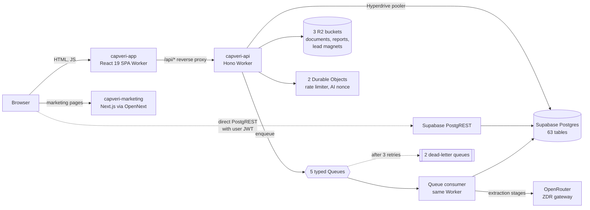
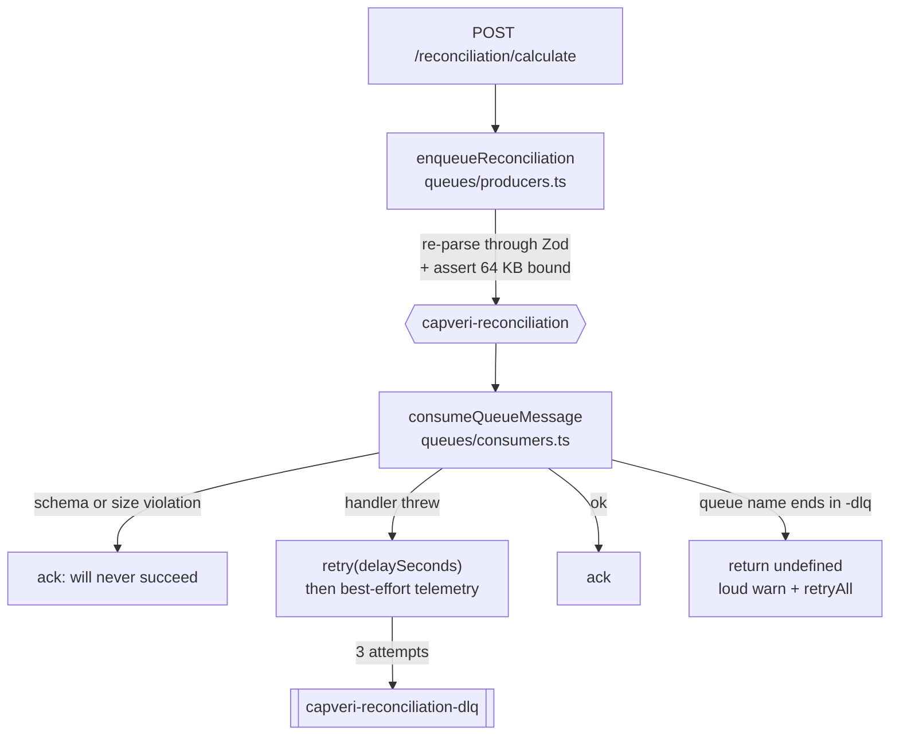
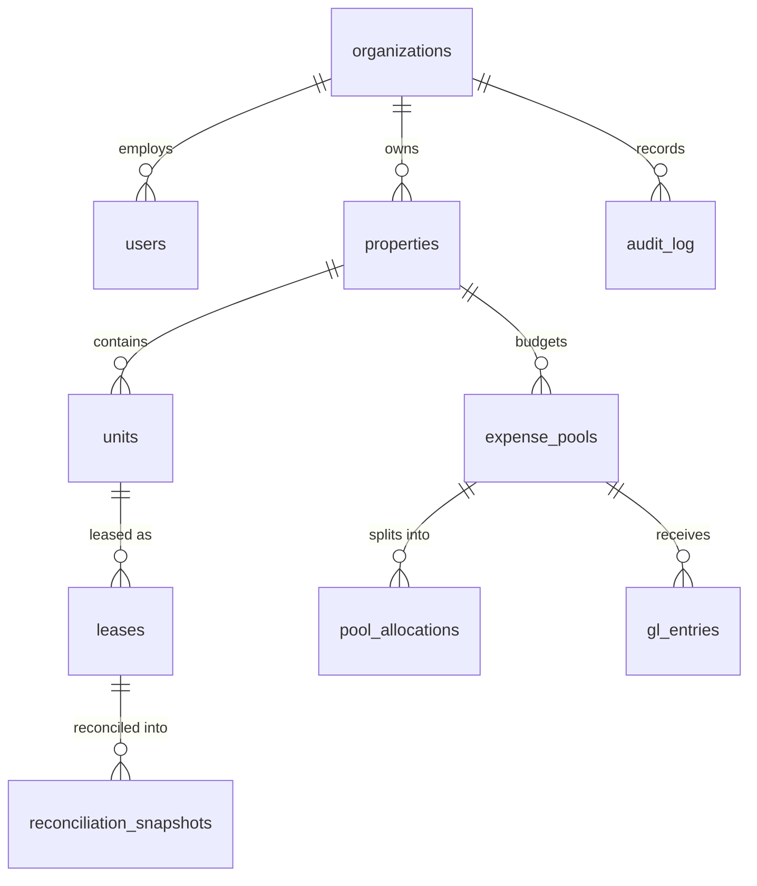

# Architecture

CapVeri ran as four independently deployed Cloudflare Workers against a Supabase Postgres
database. There was no origin server and no container. Everything below is past tense: the hosted
services were torn down in July 2026.

Counts of infrastructure objects in this document are verified against
[`cloudflare-backend/wrangler.jsonc`](../cloudflare-backend/wrangler.jsonc). Database object
counts live in [METRICS.md](./METRICS.md).

---

## The four surfaces

| Surface | Worker | Entry point | What it owned |
|---|---|---|---|
| Marketing site | `capveri-marketing` | [`marketing/open-next.config.ts`](../marketing/open-next.config.ts) | Next.js App Router packaged by OpenNext for Cloudflare. 275 MDX content pages. Bound a D1 database for AI-agent nonce replay protection. |
| Application | `capveri-app` | [`frontend/src/worker.ts`](../frontend/src/worker.ts) | React 19 + Vite SPA on Workers Static Assets. Reverse-proxied `/api/*` and stamped the security headers. |
| Backend API | `capveri-api` | [`cloudflare-backend/src/index.ts`](../cloudflare-backend/src/index.ts) → `createApp()` in [`app.ts`](../cloudflare-backend/src/app.ts) | Hono. 43 route modules. Queue producer and consumer. `limits.cpu_ms: 30000`. |
| Database | Supabase Postgres | [`supabase/migrations/`](../supabase/migrations/) | 142 migrations. Reached from the Worker over a Hyperdrive binding. |

### Why `run_worker_first` mattered

[`frontend/wrangler.jsonc`](../frontend/wrangler.jsonc) sets `"run_worker_first": true` on the
SPA Worker, with an inline comment explaining the reason: without it, Cloudflare serves `/`
straight from the static-asset cache and the Worker never executes, so the CSP, HSTS, and
Permissions-Policy headers defined in `SECURITY_HEADERS`
([`frontend/src/worker.ts:11`](../frontend/src/worker.ts#L11)) never reach the document that
needs them. The asset cache is faster and, for this one route, wrong.

---

## The async job pipeline

Reconciliation and lease extraction are too slow for a request/response cycle, so both run as
queue jobs. Five typed queues, two with dead-letter queues.

Three decisions in [`queues/consumers.ts`](../cloudflare-backend/src/queues/consumers.ts) carry
their reasoning in the code, and each guards a distinct failure mode:

**Dead-letter queues are not substring-matched.** Queue names are routed by `includes()`, and
`capveri-extraction-dlq` contains `extraction`. `queueNameFromCloudflareQueue` returns `undefined`
for anything ending in `-dlq`, so a future misconfiguration that wires this Worker as a DLQ
consumer surfaces as an unknown-queue warning and `retryAll()` rather than silently reprocessing a
poison message through the handler that already rejected it.

**Retry is requested before telemetry.** In the catch block, `rawMessage.retry()` runs first, and
the Sentry capture is wrapped in its own `try`/`catch`. The comment states why: on a durable job
queue, a throwing `waitUntil` would otherwise skip the retry *and* escape the consumer, aborting
the rest of the batch and silently dropping jobs. This ordering was a real regression that shipped
and was caught. See [ENGINEERING-LOG.md](./ENGINEERING-LOG.md).

**Invalid messages are acknowledged, not retried.** A message that fails its Zod schema or exceeds
the size bound will never succeed, so retrying it just burns the DLQ budget. Handler exceptions
retry; contract violations get reported and acked.

Message contracts in
[`queues/messages.ts`](../cloudflare-backend/src/queues/messages.ts) are `.strict()` and
versioned (`version: z.literal(1)`). The R2 key schema rejects absolute paths, backslashes, and
`.`/`..` segments: path-traversal defence at the message boundary, before storage is involved.

### The reconciliation job runner

[`workflows/reconciliation.ts`](../cloudflare-backend/src/workflows/reconciliation.ts) is a
state machine, not a function call:

1. Load the calculation job, guard on status.
2. **Redelivery detection**: `attempts > 1` on a job already marked `running` means a prior
   attempt died mid-flight. Mark it failed so it is recoverable, rather than computing it twice.
3. Claim the job with a compare-and-set (`markCalculationRunning`).
4. **Finalized-snapshot guard**: a job created before a period was finalized could still run
   after. A finalized snapshot is an immutable audit record, so the job refuses rather than
   overwriting it.
5. Compute *outside* the transaction.
6. `persistCalculationResults` does delete-drafts, insert, and mark-complete atomically in one
   short transaction.

---

## Storage and stateful edge objects

**R2 buckets (3):** `capveri-documents` (uploaded leases and GL files), `capveri-reports`
(generated PDF and XLSX exports), `capveri-lead-magnets`. Adapters in
[`src/adapters/storage/`](../cloudflare-backend/src/adapters/storage/), including
`forensic-store.ts`, which snapshots every AI extraction stage for replay. See
[AI-PIPELINE.md](./AI-PIPELINE.md).

**Durable Objects (2), both SQLite-backed:** `RateLimiterDurableObject` and
`AiContextNonceDurableObject`. Rate limiting needs a single consistent counter per key, and nonce
replay protection needs a single authoritative "has this been used" record. Workers KV is
eventually consistent and would let both leak under concurrency; a Durable Object gives one
serialized owner per key.

**Hyperdrive** fronted Postgres with a transaction-mode connection pooler. This is the most
consequential choice in the system and it has a security consequence that is not obvious. See
[SECURITY.md](./SECURITY.md).

---

## The data model

63 tables across 142 migrations. The reconciliation core is about eight of them.

Immutability is enforced at the database, not in application code:

- `gl_entries` are immutable after import.
- `reconciliation_snapshots` are immutable after finalize. A user `PATCH status=draft` affects zero
  rows; there is no unfinalize route.
- `audit_log` is append-only.
- `comparison_runs` and `comparison_findings` have no `updated_at`, no UPDATE grant, and no update
  trigger. A correction is a new run, not an edit
  ([`20260601000100_create_comparison_runs.sql`](../supabase/migrations/20260601000100_create_comparison_runs.sql)).

---

## The backend that was deliberately not deployed

[`backend/`](../backend/) is a complete Python 3.11 / FastAPI / Pydantic v2 / Pandas
implementation of the reconciliation domain. **It was not deployed.** After the migration to
Cloudflare Workers it was kept, maintained, and continuously tested as a *reference
implementation*: an executable specification the TypeScript engine is asserted against.

Keeping a second full implementation alive is expensive and it is the least obvious decision in the
repo. The reasoning, the 21 property-based parity suites, and the cases where the TypeScript
deliberately diverges from the reference are in [ORACLE.md](./ORACLE.md).

---

## Observability

- **Sentry** on the Worker ([`src/platform/sentry.ts`](../cloudflare-backend/src/platform/sentry.ts))
  with a PII scrubber that regex-strips JWTs, emails, and IPs from every string and recursively
  redacts a sensitive-key set. `shouldReport` suppresses `ZodError` and any `HttpError` below 500,
  so validation noise never reaches the issue tracker.
- **PostHog** server-side
  ([`src/adapters/analytics/posthog.ts`](../cloudflare-backend/src/adapters/analytics/posthog.ts))
  with a key-name PII filter and `org:{organizationId}` as the distinct ID, never a user identity.
- **Workers observability** enabled at `head_sampling_rate: 1` (100%) on all three Workers.
- **Audit trail**: `audit_log`, plus `audit_pipeline_events` (one row per AI stage), plus a
  `calculation_trace` JSONB with a `trace_checksum` on every reconciliation snapshot.
