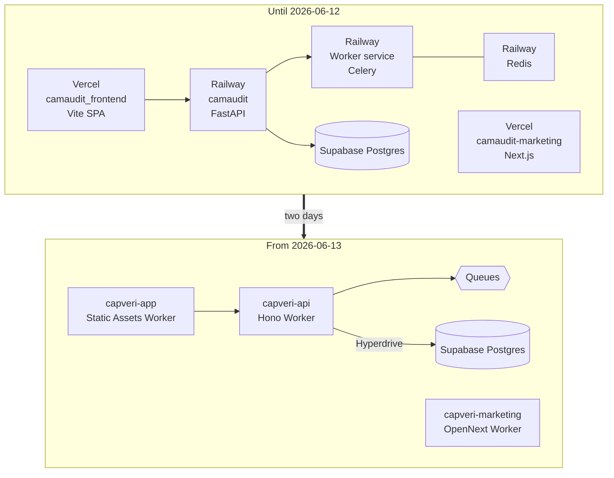

# How it got to Cloudflare

[ARCHITECTURE.md](./ARCHITECTURE.md) describes four Cloudflare Workers over Supabase Postgres. That
is where the system ended, and it is not where it started.

CapVeri ran for roughly six months on Railway and Vercel: a FastAPI application, a Celery worker, and
a Redis broker on Railway, with the React SPA and the Next.js marketing site on Vercel. Both halves
moved to Cloudflare on 12 and 13 June 2026, two days apart, as two separately planned projects that
happened to land together.

This document is the part of the record that the final architecture erases.



---

## The Railway era

The Python backend deployed to Railway from a `deploy` branch, and `api.camaudit.io/health` was the
liveness check. Three billable services ran there: the FastAPI API, a Celery worker for extraction
jobs, and the Redis instance acting as Celery's broker and result backend.

Almost none of that configuration is in this repository, and the absence is itself a finding. No
`railway.json`, `railway.toml`, `Procfile`, or `nixpacks.toml` was ever committed. The builder,
start command, root directory, and health-check path lived in Railway's dashboard, reachable only by
whoever had the login. The retired guide at
[`docs/guides/02-deployment/03-backend-deployment-railway.md`](../docs/guides/02-deployment/03-backend-deployment-railway.md)
is the closest thing to a record, and it is a set of instructions for clicking through a web
interface.

The one Railway detail that did leak into version control was an environment variable name,
`RAILPACK_PYTHON_VERSION`, pinned because cache-cold builds intermittently failed to find a
precompiled Python. That is what dashboard-owned infrastructure looks like from inside a repository:
you find out it existed because something broke and left a variable behind.

## The Vercel deploy-cap outage

This is the more instructive story, because it was self-inflicted, it took four attempts to fix, and
each attempt is written up in the commit that made it.

Both Vercel projects rebuilt on every push to `master`. At the merge velocity of a solo project with
an aggressive review loop, that burned through the free tier's 100 deploys per day. Once the cap was
hit, Vercel returned 429 to the GitHub webhook and created no deployment at all. Nothing failed
loudly. Deploys simply stopped happening until the next 00:00 UTC reset.

| Date | Commit | What was tried, and how it broke |
|---|---|---|
| 06-05 | `ec9e29c38` | Add an `ignoreCommand` so a project only builds when its own directory changed. Correct idea. |
| 06-07 | `180bd461d` | The guard used `git diff --quiet HEAD^ HEAD ./`. Vercel's build container has no git history, so the command exited 129 and Vercel marked the deploy ERROR. |
| 06-08 | `ab3af58d9` | Made the marketing guard survive a missing git. By then the last healthy marketing deploy was 19 deploys old, and production had been serving a stale pricing page the whole time. |
| 06-10 | `5460da6e0` | The diff ran from the repository root with a `-- .` pathspec, so it matched the entire monorepo. A backend-only commit still rebuilt both frontends. Scoped the pathspec to the project subdirectory. |
| 06-10 | `dc54d0ae9` | `HEAD^` does not exist in Vercel's shallow clone either, so the `\|\| exit 1` fallback forced a build on every commit. Switched to Vercel's own `VERCEL_GIT_PREVIOUS_SHA`. |

Four separate failure modes, all from the same underlying mistake: writing a build-time guard that
assumed a full git repository, on a platform that gives you a shallow one without saying so. The
`|| exit 1` fallback that was meant to fail safe is what turned each broken assumption into a full
rebuild, which is the direction it should fail, and which is also why the problem stayed invisible
for five days.

The final form survives in the tree. Both projects still carry a `vercel.json` at
[`marketing/vercel.json`](../marketing/vercel.json) and
[`frontend/vercel.json`](../frontend/vercel.json), kept after the Cloudflare cutover as a rollback
path. The guard they ended up with reads:

```bash
test -n "$VERCEL_GIT_PREVIOUS_SHA" \
  && git fetch origin "$VERCEL_GIT_PREVIOUS_SHA" --depth=1 >/dev/null 2>&1 \
  && git diff --quiet "$VERCEL_GIT_PREVIOUS_SHA" "$VERCEL_GIT_COMMIT_SHA" -- marketing/ \
  || exit 1
```

Three guarded conditions before the diff is trusted, and a fallback that builds rather than skips.

Whether these outages caused the move to Cloudflare a week later is not something the repository
says, and the migration plan does not claim it. The dates are two days apart, and that is all that is
on the record.

## Two migrations, two days

Two plan documents were written on 12 June 2026, and they are explicitly independent of each other.
[The frontend plan](../docs/superpowers/plans/2026-06-12-cloudflare-workers-vercel-migration.md) states its
goal as moving the marketing site and the app off Vercel "while preserving Railway for the FastAPI
backend." [The backend plan](../docs/superpowers/plans/2026-06-12-cloudflare-railway-migration.md) states
its goal as eliminating the Railway bill.

### The frontends, 12 June

`faff245896` moved both. 36 files, +9,751 and -4,491.

- `frontend/` became **Workers Static Assets** with
  `assets.not_found_handling = "single-page-application"`.
- `marketing/` became an **OpenNext** Worker, built through
  [`marketing/scripts/cloudflare-env-runner.mjs`](../marketing/scripts/cloudflare-env-runner.mjs),
  which validates public environment variables, runs `next build --webpack` with standalone output,
  packages with OpenNext, applies D1 migrations, and deploys with Wrangler.

Three obstacles were worth the effort:

**The CSP had nowhere to live.** It had been a `headers` block in `frontend/vercel.json`. Workers
Static Assets has no equivalent, so the policy moved into a fetch handler at
[`frontend/src/worker.ts:18`](../frontend/src/worker.ts#L18). The header is now code, which means
it is also now testable.

**An in-memory map cannot be a security control on Workers.** The marketing site's AI context
endpoint tracked replay nonces in a module-level map. On Vercel that mostly worked. On Workers,
isolates are created and discarded per request with no shared memory, so the map would have been
empty whenever it mattered. The plan flagged it before cutover and it became a D1 database,
[`marketing/migrations/0001_ai_sdr_nonces.sql`](../marketing/migrations/0001_ai_sdr_nonces.sql).
This is the class of bug that a platform migration surfaces and a test suite does not: nothing was
wrong with the code, the runtime's assumptions changed underneath it.

**A load-bearing config line.** `output: "standalone"` at
[`marketing/next.config.ts:150`](../marketing/next.config.ts#L150) is required for the OpenNext
build and is annotated in the deployment doc as a thing not to remove. Fragile, and documented as
fragile.

### The backend, 12 to 13 June

This was not a lift and shift. There was no container to move, because Workers do not run one. The
FastAPI application had to be rewritten in TypeScript.

| | Python, on Railway | TypeScript, on Workers |
|---|---:|---:|
| Route modules | 52 | 43 |
| Route-layer lines | 22,128 | 22,770 |

The route counts are not a one-to-one mapping. Some Python modules were split, some merged, and the
`cloudflare-backend/src` tree is 140,504 lines all in, because the port also absorbed domain logic,
adapters, and tests. Roughly 43 commits carried it, each one a slice with its own tests and its own
review pass, all itemised in
[`docs/architecture/cloudflare-railway-migration-inventory.md`](../docs/architecture/cloudflare-railway-migration-inventory.md).

The porting rule was to preserve behaviour exactly, which for financial code meant porting the
language semantics too, not the intent:

- A `PyDecimal` clone at precision 28, so that money arithmetic and display formatting reproduce
  CPython's `Decimal` including its rounding mode.
- Line-level ports of `fnmatch.translate`, `python-Levenshtein`'s ratio, an isolation-forest anomaly
  detector, and `dateutil.relativedelta` with its leap-year clamp.

Two decisions broke that rule deliberately, and both were recorded as decisions rather than done
quietly.

**The ARIMA detector was retired on both backends.** A statsmodels maximum-likelihood ARIMA is not
faithfully reproducible inside a Worker. Rather than ship an approximation that would silently
disagree with the reference implementation, the feature was removed from the Python side as well.
Deleting a feature from the specification is a better outcome than having two implementations that
almost agree.

**The Resend webhook signature check diverged on purpose.** The FastAPI implementation verified HMACs
with a scheme that does not match the Svix specification Resend actually uses. The port was written
to the specification instead of to the existing code, which means the Worker accepts real Resend
payloads and the Python version would reject them. It is logged in the inventory as an intentional
divergence with the old behaviour named.

This is the same instinct as the correctness oracle described in [ORACLE.md](./ORACLE.md). Parity
with a reference is the default, and it is not the goal.

The Worker test suite grew alongside the port, from 1,051 to 1,416 tests across 81 files by the time
the HTTP surface was complete.

### Cutover and teardown, 13 June

`e3ecefa87` added the production route for `api.capveri.com/*` on the `capveri.com` zone, so
Cloudflare intercepted the proxied origin at the edge and served the Worker instead of forwarding to
Railway. A DNS change was not needed. The health check confirmed it: `api.capveri.com/health`
returned `{"status":"healthy","runtime":"cloudflare-workers"}` with no `X-Railway-Edge` header.

Then the interesting bit, which is what happened before anything was deleted. Celery still had a job
queue, and Railway still had a Redis holding it. Instead of assuming it was idle, `extraction_jobs`
and `documents` were queried directly for rows in `processing`, `retrying`, or `queued`. All three
came back empty, which is the proof that deleting the worker would drop nothing.

Only then was the entire Railway project deleted in one command, taking the API, the Celery service,
Redis, and its volume with it. The record is in
[the migration inventory](../docs/architecture/cloudflare-railway-migration-inventory.md), and it states
the outcome as `$0` going forward.

## What was gained

One migration technique here is worth stealing. Persisted exports had to move from Supabase Storage
to R2 without a schema change or a backfill, so new rows write their `storage_path` as `r2:{key}`
and old rows keep their bare key. The prefix is the discriminator, the read path branches on it, and
both storage backends serve traffic at once. No migration window, no backfill job, no dual write.
It is at [`adapters/storage/reports.ts:32`](../cloudflare-backend/src/adapters/storage/reports.ts#L32).
