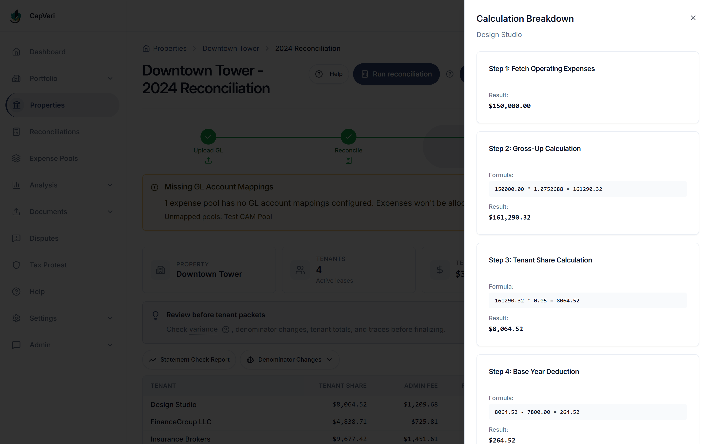
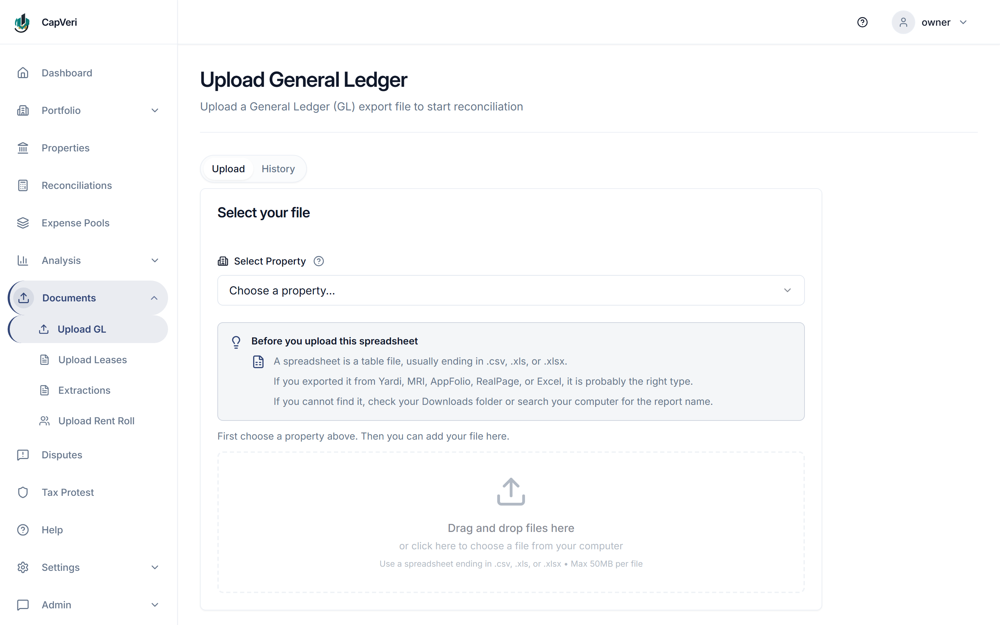
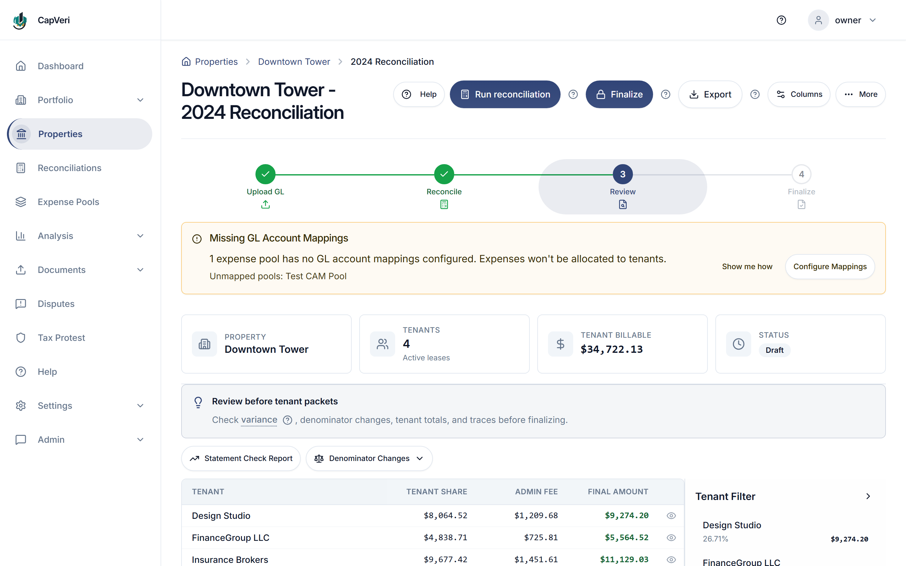
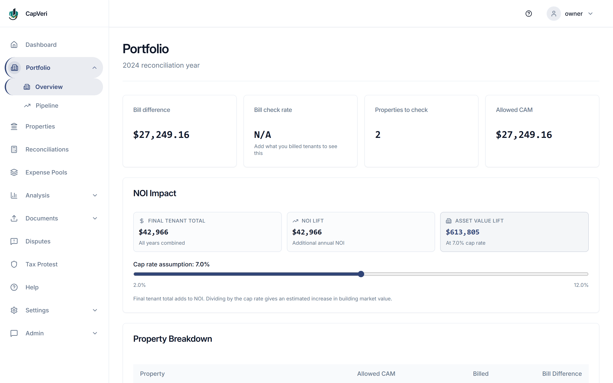
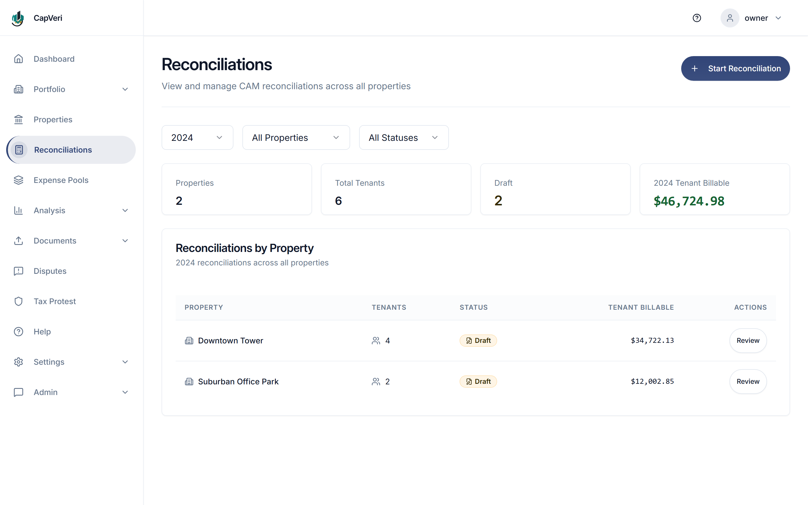
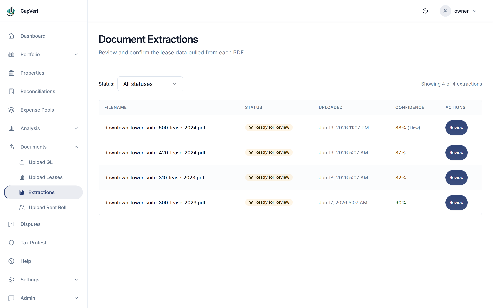
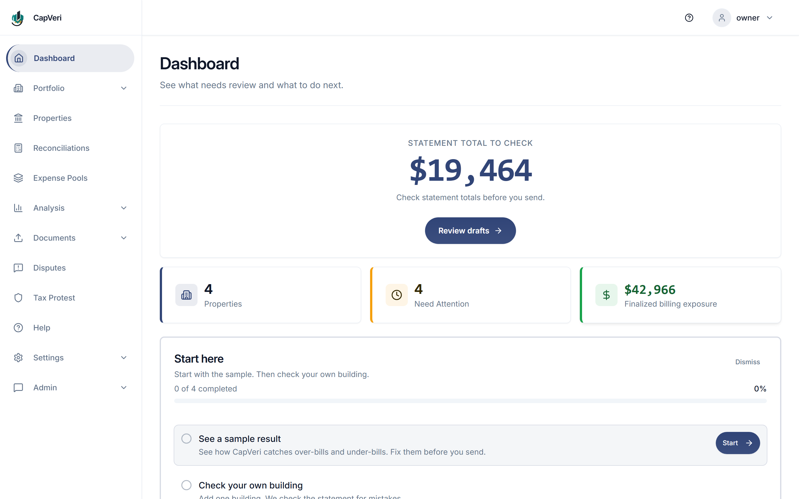
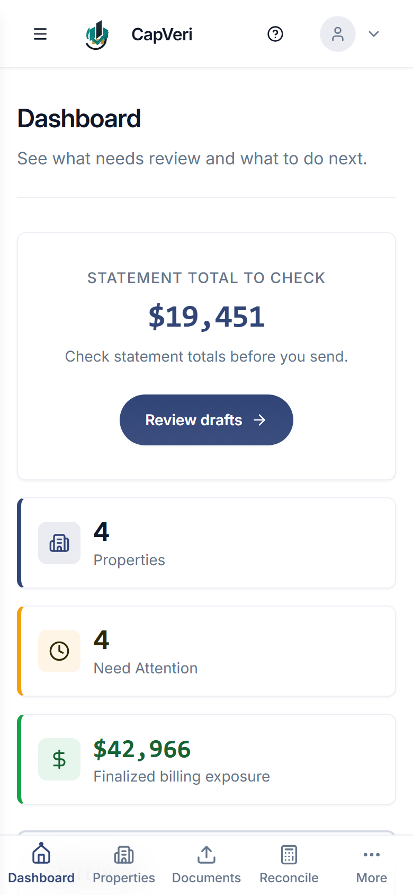
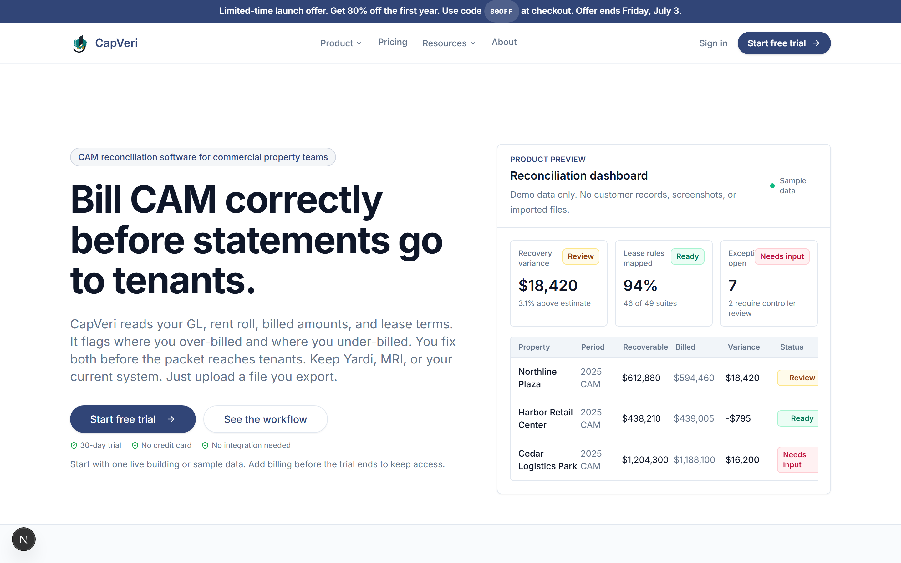

# What CapVeri did

A domain primer and a look at the interface, for readers who arrived for the engineering and do not
work in commercial real estate.

For the same product told as a sequence, with the code behind each screen, see
[WALKTHROUGH.md](./WALKTHROUGH.md).

---

## The problem

A commercial landlord runs a building and pays its operating costs: cleaning, security,
landscaping, insurance, property tax, management, snow removal. Under a triple-net lease, the
tenants reimburse those costs in proportion to the space they occupy. This is **CAM**: Common Area
Maintenance.

Through the year each tenant pays a monthly estimate. After the year closes the landlord has to
work out what each tenant *actually* owed, and issue a true-up bill or a credit.

That calculation is not a division. Every lease was negotiated separately, and each one modifies
the arithmetic: a different pro-rata denominator, a cap on year-over-year increases, a base year, an
administrative fee with certain pools excluded from its base, a management fee that is really a cap,
a gross-up provision that restates costs to a target occupancy. A mid-year lease start prorates
everything by day.

In practice this is done in Excel, once a year, under time pressure, by someone who also has
another job. Errors go in both directions: landlords under-recover money they were owed, and
tenants get billed for costs their lease excludes, which is how CAM disputes start.

## What the product did

Import the exports the landlord's property-management system already produces (a general ledger,
a rent roll) plus the lease PDFs. Extract the CAM terms from the leases with a human confirming
every field. Compute each tenant's true-up. Show the arithmetic.

**No integrations.** No API connection to Yardi, MRI, or RealPage. The product read the CSV and
Excel exports those systems already generate. That removed integration contracts, version coupling,
and the IT project that a live connection implies, and it meant the product worked on day one with
whatever software the customer already had.

The tradeoff is real and was accepted deliberately: no live sync, and the user has to export a file.
For an annual reconciliation, that is the right side of the trade.

---

## The interface

Every image below was captured from the local stack running against the seeded development
database: `frontend/scripts/portfolio-screenshots.mjs` and `marketing/scripts/portfolio-screenshots.mjs`
reproduce them. Nothing is mocked up, and nothing was staged: where the seed data produces a warning
or a blocked action, the warning is in the shot.

### The calculation trace

Every figure on the screen expands into the steps that produced it, and each step carries its literal
arithmetic: `150000.00 * 1.0752688 = 161290.32` for the gross-up, `161290.32 * 0.05 = 8064.52` for
this tenant's share, `8064.52 - 7800.00 = 264.52` for the base-year deduction. This is what a landlord
sends to a tenant who disputes the bill. It is also the reason the engine had to be deterministic:
a trace that cannot be reproduced exactly is worse than no trace.

### Getting the data in

The anti-integration bet as the user met it. The screen names the systems a landlord already runs and
asks for the file they already export, rather than for credentials to connect to one. The help text
below it ("If you cannot find it, check your Downloads folder") is aimed at the person who does this
once a year and is not a full-time operator of the software.

### The reconciliation being reviewed

Four steps (upload the GL, reconcile, review, finalize), and the finalize step is not reachable
until review happens. The amber banner is a real check firing on the seeded data: one expense pool
has no GL account mappings, so its expenses would not reach any tenant. The product says so before
the numbers are trusted rather than after.

### The portfolio roll-up

The recovery difference translated into the two numbers a landlord's principal actually acts on:
additional annual NOI, and the implied change in building value at an adjustable cap rate. The
slider is there because the cap rate is an assumption, and assumptions belong to the user.

### Reconciliations across the portfolio

### AI extraction, and the gate it cannot pass on its own

![Extraction review for downtown-tower-suite-500-lease-2024.pdf. The source pane on the left has failed with "We couldn't load the PDF" and a Try again button. Because of that, the Approve and Commit button at the top is greyed out and disabled, with "Load the source PDF before you approve." printed beneath it. The right pane lists the extracted lease terms with per-field confidence: Base Year 2024 at 95%, Pro-Rata Share 4.2% at 87%, and a Base Year Amount reading "Not extracted" annotated "The AI didn't find a value. Add one if you have it." Verification Progress reads 0 of 7, with a badge showing 1 need review](./screenshots/10-extraction-review.png)

**This is the invariant being demonstrated, not a broken screen.** The screenshot is a proof by
construction: the source PDF failed to load, so the reviewer *cannot* check the extraction against
the document, so **Approve & Commit is disabled** and the reason is printed underneath it:
*"Load the source PDF before you approve."* The path from model output to a lease record is closed
in exactly the case where verification is impossible. A screenshot of a successful commit would show
the happy path; this one shows the guardrail, which is the harder thing to prove and the only one
worth a picture.

The mechanism behind it: an extraction lands in `documents.extraction_result`, a human verifies each
field against the source document, and only then does anything reach `leases.recovery_profile`.
Model output never writes lease terms directly. The disabled button is that rule, rendered.

The right pane shows what the human is given: a confidence score per field, an explicit
*"The AI didn't find a value"* on the field it could not extract, and per-field confirmation with
undo. Verification progress reads 0 of 7. → [AI-PIPELINE.md](./AI-PIPELINE.md)

### Dashboard, desktop and mobile

### The marketing site

A Next.js App Router site with 275 MDX pages, served by its own Cloudflare Worker through OpenNext.
The promotional banner is a fixed-deadline offer that expired before the sunset; it renders here
because this is the site as it stood, not a cleaned-up reconstruction.

---

## Where the engineering went

The domain above is why this codebase looks the way it does:

- Every figure a tenant could dispute has to be reproducible, so each reconciliation snapshot
  persists a full `calculation_trace`, a checksum, and the lease terms as they stood at
  calculation time.
- The arithmetic decides who owes whom, so money is integer cents in `BigInt` and never a float, and
  a second implementation exists purely to disagree with the first:
  [RECONCILIATION-ENGINE.md](./RECONCILIATION-ENGINE.md) and [ORACLE.md](./ORACLE.md).
- Lease terms come out of a language model, so the model writes to a quarantine and a human
  promotes: [AI-PIPELINE.md](./AI-PIPELINE.md).
- Landlords and their tenants share one database, so route access is default-deny and JWT claims
  are never trusted: [SECURITY.md](./SECURITY.md).
