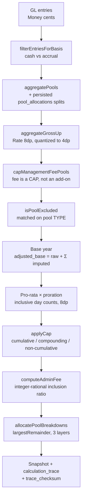

# The reconciliation engine

Source: [`cloudflare-backend/src/domain/reconciliation/`](../cloudflare-backend/src/domain/reconciliation/)
(5 files, ~2,800 lines). Engine version string: `cloudflare-reconciliation-v1`.

---

## What CAM reconciliation is

A commercial landlord pays the operating costs of a building: cleaning, security, landscaping,
insurance, property tax, management. Under a triple-net lease the tenants reimburse those costs.
During the year each tenant pays a monthly estimate. After the year closes, the landlord computes
what each tenant actually owed and issues a true-up bill or a credit.

Computing "what they actually owed" is where the difficulty lives, because the lease modifies the
arithmetic:

- **Pro-rata share**: the tenant pays their fraction of the building. Which fraction depends on
  the lease's denominator: total building area, occupied area, or a negotiated fixed percentage.
- **Gross-up**: if the building is 60% occupied, a fixed cost like security still costs what it
  costs. Gross-up restates variable costs to what they *would* have been at a target occupancy
  (typically 95%) so an occupied tenant is not subsidized by vacancy. Fixed costs like tax and
  insurance are never grossed up.
- **Caps**: many leases cap year-over-year increases in controllable expenses. Caps come in
  flavours: non-cumulative, cumulative (unused allowance banks forward), and cumulative-compounding
  (the base grows exponentially).
- **Base year**: the tenant pays only the increase over a reference year's costs.
- **Administrative fee**: a percentage on top, often with certain pools excluded from its base.
- **Management fee**: usually a *cap* on the management pool, not an additive charge, which makes
  it circular: the fee is a percentage of a base that excludes the fee.
- **Proration**: a lease that starts mid-year owes a day-weighted fraction.

Every one of those is a place to lose money in either direction, and they interact. Getting the
order wrong changes the answer.

---

## Money is never a float

[`money.ts`](../cloudflare-backend/src/domain/reconciliation/money.ts) defines two value types.
Both are `bigint` fixed-point internally, so precision is exact and the usual floating-point
objections do not apply.

```ts
const CENT_SCALE = 100n;              // Money: integer cents
const RATE_SCALE = 100_000_000n;      // Rate: 8 decimal places
```

`Money.parse` refuses anything that is not a plain decimal literal:

```ts
const text = String(value).trim();
if (!/^-?\d+(\.\d+)?$/.test(text)) {
  throw new Error(`Invalid money value: ${text}`);
}
```

That regex rejects `NaN`, `Infinity`, `1e3`, `0x10`, and `0b101`, every one of which a sibling
parser elsewhere in the codebase once accepted, with consequences documented in
[ENGINEERING-LOG.md](./ENGINEERING-LOG.md). A third decimal digit of 5 or more rounds the cent up:

```ts
const cents = BigInt(whole) * CENT_SCALE
            + BigInt(padded.slice(0, 2))
            + (Number(padded[2]) >= 5 ? 1n : 0n);
```

Every division in the engine goes through one primitive, `roundDivide`, which is sign-aware and
rounds half away from zero. One rounding rule, one implementation, one place to be wrong.

`Rate.quantize(decimals)` carries a docstring naming the exact reason it exists: the gross-up
oracle in `backend/app/services/calculation/gross_up.py` quantizes the gross-up factor to 4 decimal
places *before* applying it, so the Worker must do the same to stay penny-for-penny with the
reference implementation. The constant is not arbitrary and the comment says where it came from.

**Where `Rate` is deliberately not used.** Multi-year compounding needs more than 8 decimal places
of intermediate precision. For that, the engine switches to `decimal.js` configured at precision
28 with `ROUND_HALF_UP`, and the module comment states that using `Rate` there would cause
multi-year runs to diverge.

---

## The calculation order



The orchestrator is `calculateReconciliationSnapshots(dataset)` in
[`calculator.ts`](../cloudflare-backend/src/domain/reconciliation/calculator.ts) (1,787 lines).
A few steps are worth calling out.

### Penny conservation

Any time a total is split (a GL entry across pool allocations, a capped amount across pools, an
admin fee across fee-eligible pools), the engine uses `largestRemainder`, an integer-cent
proportional allocator that sums to **exactly** the total. Leftover cents go to the largest
fractional remainders, ties broken by lowest index. It is a direct port of the reference
implementation's `_largest_remainder`, including the tie-break, because a different tie-break is a
different bill.

This matters more than it sounds. A version that rounded each slice independently manufactured a
phantom cent per GL entry, and the error accumulated linearly with row count: see
[ENGINEERING-LOG.md](./ENGINEERING-LOG.md).

### Occupancy is day-weighted, and clamped

`calculateActualOccupancy` weights each lease's square footage by its inclusive active-day overlap
with the period, quantizes to 4 decimal places, and then **caps the result at 1.0**. The comment
explains why the clamp is not just defensive tidiness: overlapping or double-booked leases would
push computed occupancy above 100%, which shrinks the gross-up safety valve and causes systematic
*under*-recovery. Malformed leases where start is after end are skipped rather than contributing
negative days.

Gross-up target occupancy is clamped to ≤ 1.0 for a different reason: a landlord typing `95`
instead of `0.95` would otherwise gross expenses up by roughly 95×.

### The gross-up safety valve is applied once

`aggregateGrossUp` sums the grossable pools, grosses the sum **once**, applies a single
100%-occupancy safety valve (`min(grossed, booked / occupancy)`), then adds the fixed pools back.

An earlier version applied the valve per pool. The comment records both failure modes: a per-pool
valve drives a net-credit pool *more* negative, and it accumulates rounding drift across pools.

Tax, insurance, and capital pools are never grossed up, regardless of the `is_gross_up_applicable`
flag stored on the row. This is a deliberate divergence from the reference implementation,
documented in place: three separate Worker write paths default that flag to `true` with no coupling
to pool type, so mis-flagged data would over-bill. Guarding in the engine fixes it for existing
rows without a data migration.

### Pro-rata share is rejected, not clamped

`assertProRataShareInRange` hard-rejects a share outside `[0, 1]`, naming the lease and the source
of the value. The comment spells out the reasoning: a share of 1.2 applied to a $200,000 pool
over-bills by $40,000, and clamping to 1.0 would produce a plausible-looking number while *hiding*
the bad denominator that caused it. Failing loudly is the correct behaviour for a data error that
changes money.

### The management fee is a cap, not a charge

`capManagementFeePools` treats the lease's `management_fee_percentage` as a ceiling on the
management pool:

```text
cap = max(0, round_half_up(rate × operating_base_excluding_fee))
```

Multiple fee pools are reduced pro-rata via `largestRemainder`, iterated in **name-sorted order**
to match the reference implementation's `sorted(pool_names)` tie-break exactly. The removed excess
is surfaced explicitly so it cannot leak into the exclusion, base-year, pro-rata, cap, or
admin-fee steps downstream.

### Cap banks

[`cumulative-cap.ts`](../cloudflare-backend/src/domain/reconciliation/cumulative-cap.ts)
implements two cap types, and its header comment is the clearest example in the repo of a decision
being recorded rather than assumed:

> [!WARNING]
> This intentionally does NOT reuse `simulateCapBank` from `cap-bank-ledger.ts`. That
> module floors the running bank to zero every year for BOTH cap types; the reconciliation oracle
> floors the compounding bank exactly ONCE (`caps.py` line 521-522) and only floors the cumulative
> bank once after the running-balance simulation (`caps.py` line 323). The semantics diverge on
> bank-then-over sequences, so the math is ported here directly.

Two functions that look interchangeable are not, and the difference only appears on a specific
input sequence: a year under the cap (banking allowance) followed by a year over it.

**This was verified against real money.** A production scenario ran three consecutive finalized
years: a 2023 seed at $100,000, a 2024 year under cap at $103,000 (accruing allowance), then a
2025 year with $140,000 of GL. The cap bound at **$128,012.50**, matching an offline calculation of
`maxAllowed 115,762.50 + carried bank 12,250.00`. Per-year flooring would have produced
$115,762.50, a **$2,250 under-bill**. The engine returned the once-floored figure.

Guardrails ported alongside the math, each tagged with the reference fix it came from: cap rate
bounded at 1.0, exponent bounded at 50 years, rates and fixed amounts required non-negative.

### Per-pool attribution

`allocatePoolBreakdowns` splits the final numbers back across pools in three layers: the pre-cap
share by recoverable contribution, then the cap reduction attributed to cap-eligible (controllable)
pools first and spilling to exempt pools only if necessary, then the admin fee across fee-eligible
pools. Every layer uses `largestRemainder`, so the per-pool figures sum exactly to the aggregates
and no component is driven negative.

That is what makes the per-pool breakdown in the UI trustworthy: it is not a display-time
approximation, it is an exact decomposition of the number that was billed.

### Every snapshot carries its own audit trail

Each snapshot persists a `calculation_trace` JSONB, a `trace_checksum`, and a
`lease_terms_snapshot`, the lease terms as they stood when the number was computed. A snapshot is
reproducible without depending on the current state of the lease record.

---

## Correctness

The engine is asserted against a separate Python implementation kept as an executable
specification, with 21 property-based parity suites, and in a handful of documented cases the
TypeScript deliberately disagrees with it. See [ORACLE.md](./ORACLE.md).
