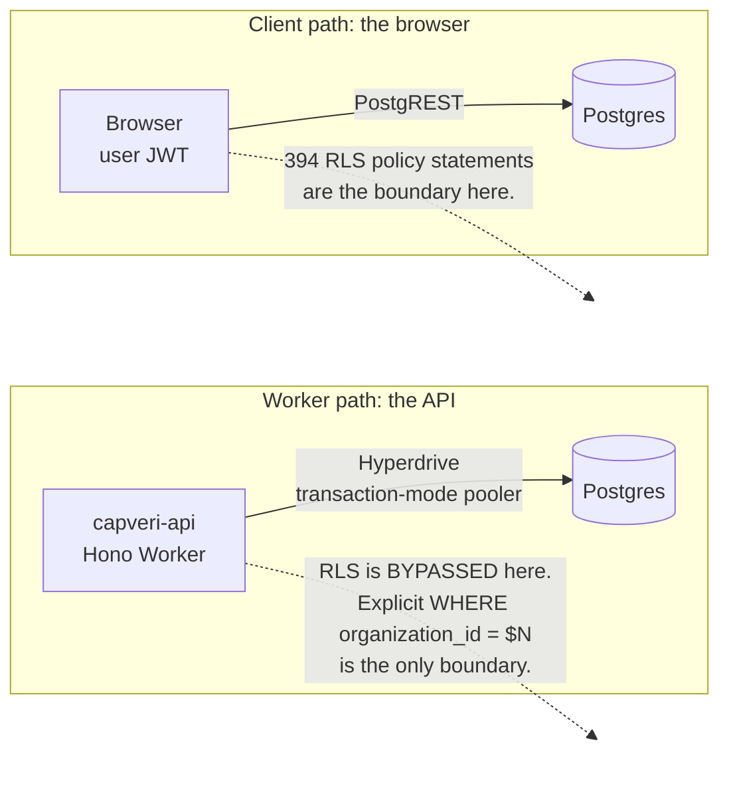

# Multi-tenancy and security

CapVeri held two kinds of tenant in one Postgres database: landlord organizations, and the
commercial tenants those landlords billed. Both could log in. A landlord's CAM expense pools, GL
entries, and lease recovery profiles are commercially sensitive against *other landlords*, and a
tenant's reconciliation statement is sensitive against *other tenants of the same landlord*.

That produced a boundary that is easy to get subtly wrong, and one live bug that proved it.

---

## The two database paths

This is the least obvious thing about the system and the reason both defences exist.



The Worker reached Postgres through a **Hyperdrive transaction-mode pooler, which bypasses row-level
security**. Connections are shared and reused across requests, so the per-session role context RLS
depends on cannot be relied upon. On that path the only tenant boundary is an explicit
`where organization_id = $N` (or `tenant_user_id = $N`) predicate in every query.

The browser also talked to Postgres directly through PostgREST with the end user's JWT, for a small
number of read paths. On *that* path, RLS is the entire boundary.

So the 394 RLS policy statements are not decoration behind the API: they are the load-bearing
control on a different access path. Both had to be right, and they failed differently.

**A complication that traps people:** a tenant user's `organizationId` is the *landlord's* org id.
Scoping a tenant-portal route by organization therefore scopes it to nothing. Tenant routes must
scope by `tenant_user_id`.

---

## Default-deny by party

[`cloudflare-backend/src/middleware/auth.ts`](../cloudflare-backend/src/middleware/auth.ts)
makes the safe case the default:

```ts
const DEFAULT_ALLOWED_PARTIES: readonly ActorParty[] = ["landlord"];
```

A route gets landlord-only access unless it explicitly opts in:

```ts
authMiddleware({ parties: ["landlord", "tenant"] })
```

The JSDoc states the threat directly: this stops a tenant-role JWT (whose `actor.organizationId`
is the landlord's org) from reading landlord data through landlord routes that only scope by
organization. Because the default is restrictive, forgetting to think about parties on a new route
produces a 403, not a leak. Adding a route is safe by omission.

## JWT claims are never trusted

The middleware verifies the Supabase JWT (algorithms pinned to ES256/RS256 in
[`adapters/auth/supabase-jwt.ts`](../cloudflare-backend/src/adapters/auth/supabase-jwt.ts)),
and then **re-reads role, `organization_id`, party, and `is_platform_admin` from the `users` table
by `sub` on every request**. A forged elevated claim is inert: the token proves identity, the
database provides authority.

This costs a query per request. It buys immunity to the entire class of "attacker edits a claim"
attacks. A production stress cycle fired ten JWT attacks at the live API: expired, `alg:none`,
HS256 confusion, bit-flipped signature, forged `role`, forged `is_platform_admin`, swapped `sub`,
and garbage. All ten returned 401, with no 500s.

`assertActorContext` in
[`adapters/db/transaction.ts`](../cloudflare-backend/src/adapters/db/transaction.ts) closes the
loop: every database session validates that the actor carries a non-empty `userId`,
`organizationId`, `role`, and `party` before any query runs. Missing context throws rather than
quietly querying unscoped.

## Concurrency

Reconciliation persist and finalize are serialized per property with a Postgres advisory lock:

```sql
pg_advisory_xact_lock(hashtext('capveri:financial-evidence'), hashtext('{org}:{property}'))
```

Combined with `FOR UPDATE` and a `where status != 'finalized'` guard, concurrent finalize attempts
resolve to exactly one 200 and the rest 409.

---

## The cross-tenant leak

The most serious defect found in this project, and it was live.

**Symptom.** None. Nothing was slow, nothing errored, no alert fired. It was found by a stress
scenario that probed PostgREST directly with a customer JWT rather than going through the API.

**Root cause.** The `audit_log` SELECT policy, introduced in
`20240101000060_fix_rls_performance.sql:458`, gated only on role:

```sql
USING (EXISTS (SELECT 1 FROM public.users
               WHERE id = auth.uid() AND role IN ('owner','admin')))
```

No organization scope. Every organization has an owner by construction. So **any authenticated
owner or admin of any organization could read the entire `audit_log` across every tenant** with a
single `GET /rest/v1/audit_log`.

That table is not metadata. `audit_log.new_data` and `old_data` embed full foreign lease records,
`recovery_profile` JSON, tenant names, and GL amounts.

**Why it was invisible.** The API never used this path. It reads audit data with the service role.
The policy was only reachable by a browser hitting PostgREST directly, which no application code
did. A reviewer reading the API would never encounter it, and a reviewer reading the migration
would see a plausible-looking admin check.

**Blast radius, measured.** The reproduction returned **1,000 rows spanning 11 organizations**.
After the fix, the same request returned rows for **1 organization**.

**The fix.** [`20260701000000_scope_audit_log_select_to_org.sql`](../supabase/migrations/20260701000000_scope_audit_log_select_to_org.sql)
adds the missing predicate. Rows with a `NULL organization_id` (system events predating org
assignment) become invisible to org admins, deliberately fail-closed, and documented as such in
the migration.

**Two more found in the same sweep:**

- `audit_requests`, the platform's inbound lead inbox, carried the identical unscoped gate, and it
  was writable. Any customer owner or admin could read *and modify* every organization's lead PII.
  Restricted to `assigned_to = auth.uid() OR current_user_is_platform_admin()`.
- The `users` UPDATE policy caused **Postgres error 42P17, infinite recursion**. An inline
  `SELECT is_platform_admin FROM users` correlated subquery inside `WITH CHECK` re-entered the
  `users` RLS policy. Every self-service profile update returned 500. Fixed with a
  `current_user_is_platform_admin()` `SECURITY DEFINER` helper that runs with `row_security` off,
  the same pattern `get_user_organization_id()` already used to break the same class of cycle.
  Code review on the fix caught that `'tenant'` was missing from the policy's role list, which
  would have fail-closed tenant self-updates.

**What prevents recurrence.** The stress scenario that found it
(`prod-stress-rls-authz-isolation-scenario.mjs`) probes PostgREST directly with a real customer
JWT, which is the only way to exercise a path the application never takes. See
[PROD-STRESS-PROGRAM.md](./PROD-STRESS-PROGRAM.md).

**Where it lives.** The org-scoped `audit_log` policy is
[`20260701000000_scope_audit_log_select_to_org.sql:20`](../supabase/migrations/20260701000000_scope_audit_log_select_to_org.sql#L20).
The other three are all in
[`20260701000100_fix_users_update_recursion_and_audit_requests_scope.sql`](../supabase/migrations/20260701000100_fix_users_update_recursion_and_audit_requests_scope.sql):
the `SECURITY DEFINER` helper at line 31, the non-recursive `users` UPDATE policy at line 57, and
the `audit_requests` SELECT and UPDATE policies at lines 75 and 84. Commit `666a0d914`.

---

## Untrusted-input hardening

Billing imports accept a 25 MB XLSX from the browser. `parseBillingXlsx` read every row across the
full spanned column width, so a single cell placed at column 16,384 forced an
O(rows × 16384) dense loop and exhausted the Worker CPU budget. CWE-400, denial of service from one
small file.

The interesting part is not the bug, it is that **the first fix plan was wrong and research caught
it**. The obvious guard is a bound on `rowCount`. Reading the ExcelJS source showed `rowCount` is
`_lastRowNumber`, the spanned height, which is cheap for exactly the sparse-tall file an attacker
would send. The real cost driver is `actualRowCount`, the count of populated rows, because that is
what `eachRow({includeEmpty:false})` iterates. A `rowCount`-based guard would have rejected
legitimate sparse spreadsheets while missing the actual attack. An independent reviewer confirmed
this before the change shipped.

Final guard: reject `actualRowCount > 100_000`, clamp columns to 256. The first version of the
*test* was also wrong: a sparse cell at row 100,002 yields `actualRowCount = 2`, so the guard
correctly did not fire. It was rewritten to exercise the real condition.

A related sweep (`74c391ec1`) neutralized CSV and XLSX formula injection (CWE-1236) across every
export surface, prepending `'` to any cell beginning `= + - @ \t \r`. Two call sites were
deliberately **left alone** and annotated: `variance-xlsx.ts` interpolates the property name
mid-string into `"Statement Check Report - {name}"`, so the cell never begins with a user-supplied
character, and neutralizing it would corrupt a legitimate title like "@Tower".

**Where it lives.** The bounds are
[`domain/actual-billed/billing-parser.ts:72`](../cloudflare-backend/src/domain/actual-billed/billing-parser.ts#L72),
with the reasoning in the comment block above them, the row-count guard at line 113, and the column
clamp at lines 124-127. Commit `95e529165`.

---

## Data handling

- **Sentry** scrubs JWTs, emails, and IP addresses out of every captured string by regex, and
  recursively redacts a sensitive-key set (`password`, `token`, `secret`, `api_key`,
  `authorization`, `cookie`).
- **PostHog** drops any property whose key contains `email`, `name`, `token`, `secret`, `password`,
  `phone`, `address`, `document`, `storage`, `text`, or `note`, and identifies by
  `org:{organizationId}` rather than by user.
- **LLM calls** ran with zero-data-retention enabled and an explicit provider allowlist: see
  [AI-PIPELINE.md](./AI-PIPELINE.md).
